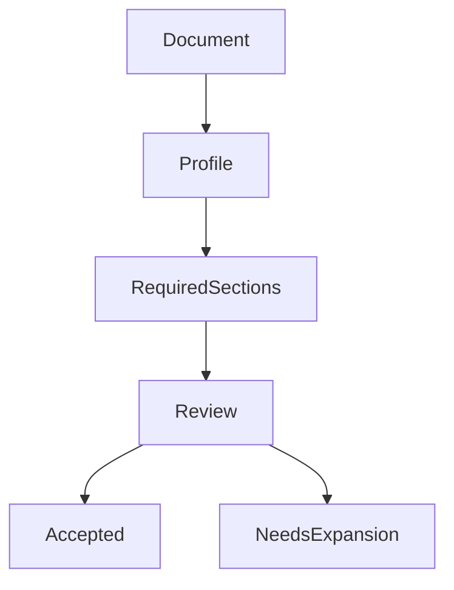
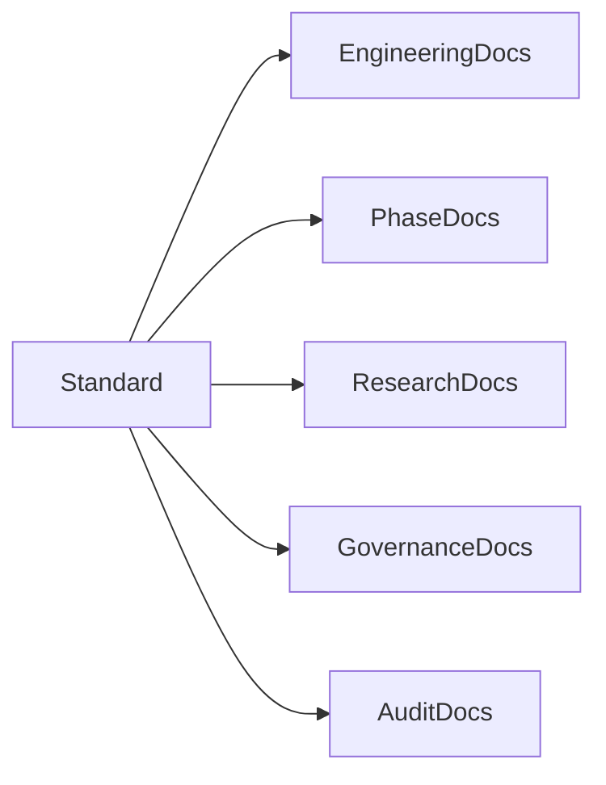
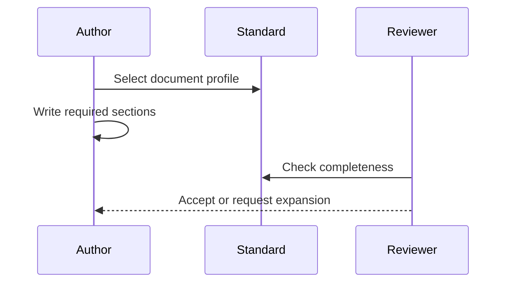
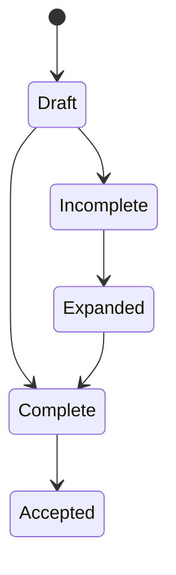

# Documentation Standard

## Purpose

This document defines the required structure, review rules, and quality bar for Atlas engineering documentation.

## Problem Statement

Atlas documentation must guide implementation of a local-first operating layer. Incomplete documents create architecture drift, unsafe authority paths, and repeated design discussions.

## Why This Subsystem Exists

The documentation standard is a governance mechanism. It gives maintainers an objective checklist for accepting architecture, subsystem, phase, feature, and dependency documents.

## User Stories

- As a contributor, I need to know what a complete Atlas document contains.
- As a reviewer, I need a checklist for rejecting shallow documentation.
- As a phase owner, I need every feature to carry requirements, workflows, failure handling, testing, and definition of done.
- As a maintainer, I need documentation changes to preserve naming, layering, dependency direction, and cross references.

## Functional Requirements

- Define required sections for engineering documents.
- Define document profiles for architecture, specification, phase, feature, research, audit, governance, and example documents.
- Define acceptance criteria for documentation reviews.
- Define how canonical documents may satisfy repeated cross-cutting sections.

## Non-Functional Requirements

- Documentation must be implementation-ready.
- Markdown is the only documentation format.
- Diagrams must be reviewable source, preferably Mermaid.
- No placeholders, vague promises, or marketing-only language.
- References must be precise enough for implementation.

## Architecture



## Component Diagram



## Sequence Diagrams



## State Diagrams



## Folder Structure

```text
docs/specifications/documentation-standard.md
docs/audits/
docs/architecture/
docs/features/
docs/phases/
docs/research/
```

## Internal Modules

The standard has four review modules: structure, technical completeness, consistency, and implementation readiness.

## Public Interfaces

The public interface is the required section checklist and document profile table.

## Data Flow

Authors create documents against a profile. Reviewers check required sections, cross references, and consistency. Accepted documents become authoritative implementation inputs.

## Lifecycle

The standard is reviewed whenever the project adds a new document type or a recurring documentation gap appears in audits.

## Threading Model

Not applicable. Documentation tooling may validate multiple files concurrently.

## IPC Model

Not applicable.

## Storage

Documentation lives in version-controlled Markdown. Generated diagrams or rendered outputs must not replace source Markdown.

## Required Engineering Sections

Architecture, specification, phase, feature, research, and implementation documents must include or explicitly link to the following sections:

1. Purpose
2. Problem Statement
3. Why this subsystem exists
4. User stories
5. Functional requirements
6. Non-functional requirements
7. Architecture
8. Component diagram
9. Sequence diagrams
10. State diagrams when applicable
11. Folder structure
12. Internal modules
13. Public interfaces
14. Data flow
15. Lifecycle
16. Threading model when needed
17. IPC model
18. Storage
19. Error handling
20. Recovery strategy
21. Security
22. Performance considerations
23. Future improvements
24. References
25. Related documents

## Document Profiles

| Profile | Applies To | Required Detail |
| --- | --- | --- |
| Architecture | `docs/architecture`, `ARCHITECTURE.md` | All engineering sections; state/threading/IPC may link to canonical docs if shared |
| Specification | `docs/specifications` | All engineering sections |
| Phase | `docs/phases` | Goal, deliverables, feature breakdown, tests, DoD, migration, risks, plus engineering sections where applicable |
| Feature | `docs/features` | User workflow, developer workflow, planner reasoning, permissions, rollback, logs, metrics, acceptance criteria |
| Research | `docs/research` | Dependency repository, license, purpose, alternatives, pros, cons, maintenance, integration, wrap/fork decision |
| Audit | `docs/audits` | Findings, actions taken, residual gaps, verification |
| Governance | Root conduct, contribution, license, security | Governance-specific structure plus enough engineering context to avoid ambiguity |
| Example | `docs/examples` | Runnable shape, manifest/API examples, validation rules, tests |

## Error Handling

If a document is missing a required section, reviewers must request expansion unless the section is not applicable and the document explains why.

## Recovery Strategy

When documentation drift is found, update the authoritative document first, then update indexes and dependent documents. Avoid patching contradictions in multiple places without resolving the source document.

## Security

Documentation must not normalize unsafe implementation shortcuts. Any document that mentions shell execution, filesystem mutation, browser automation, clipboard, screen capture, microphone, Docker, plugins, or secrets must name the permission gate.

## Performance Considerations

Performance sections should include resource budgets, cancellation points, benchmark coverage, and expected scaling limits when relevant.

## Definition Of Done

A document is complete when it satisfies its profile, contains no placeholders, links related documents, and includes enough detail for implementation or review.

## Future Improvements

Add an automated Markdown linter that validates required headings by profile, checks internal links, and renders Mermaid diagrams.

## References

- [Documentation Audit 2026-08-01](/code/ATLAS/docs/audits/2026-08-01-documentation-audit.md)
- [Implementation Map](/code/ATLAS/docs/implementation/implementation-map.md)

## Related Documents

- [Documentation Index](/code/ATLAS/docs/INDEX.md)
- [Contributing](/code/ATLAS/CONTRIBUTING.md)
