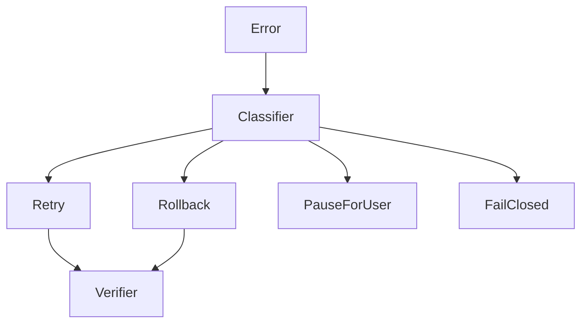
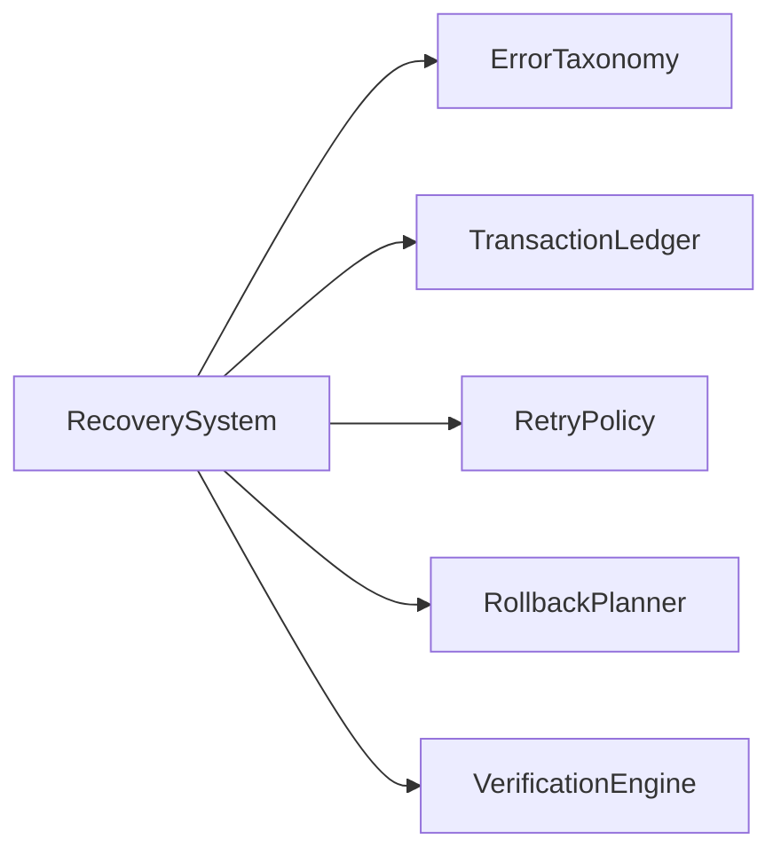
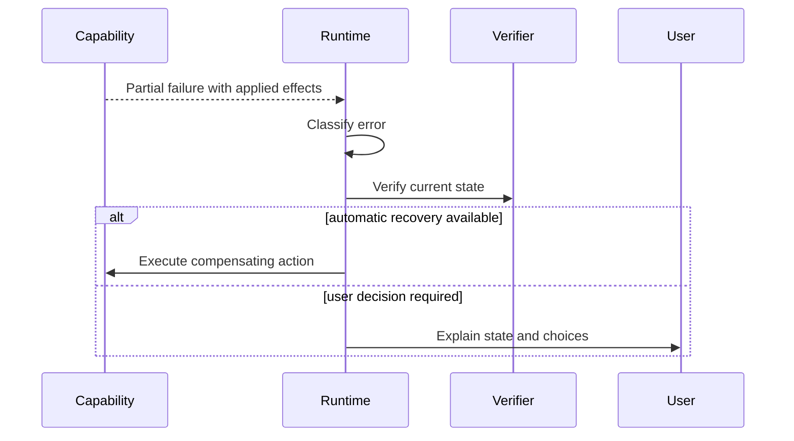
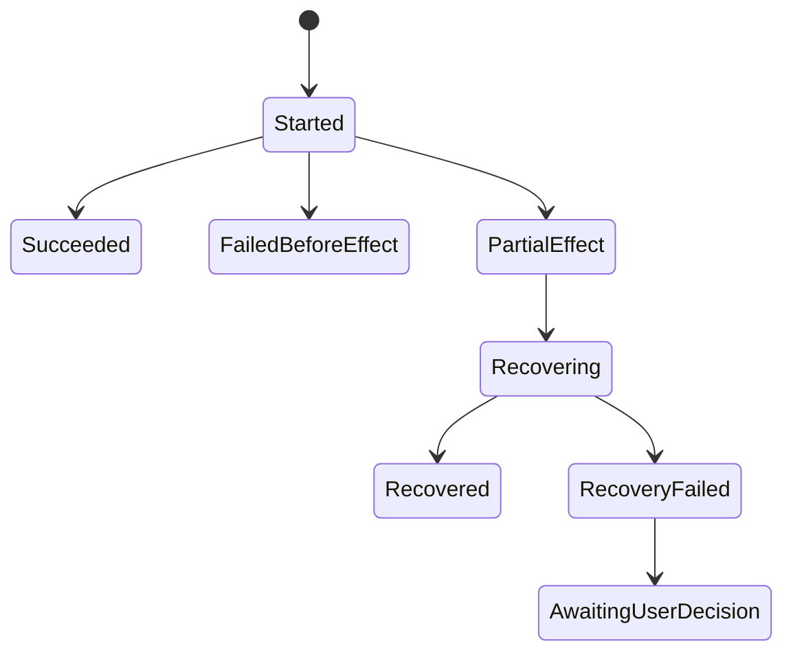

# Error Handling and Recovery

## Purpose

This document defines how Atlas reports errors, handles partial failure, and recovers from interrupted local-machine actions.

## Problem Statement

Atlas can trigger real local effects. A plan may fail after moving files, opening processes, changing Git state, posting notifications, or reading transient context. Without a shared recovery model, capabilities would invent incompatible failure behavior.

## Why This Subsystem Exists

Error handling and recovery make Atlas trustworthy. They also make debugging, audit, and regression testing possible.

## User Stories

- As a user, I need Atlas to stop safely when it is unsure.
- As a maintainer, I need failed runs to produce replayable traces.
- As a capability author, I need a standard way to report partial effects.
- As a security reviewer, I need failed authorization to prevent execution.

## Functional Requirements

- Represent errors with typed codes and structured context.
- Distinguish planned effects, applied effects, verified effects, and unknown effects.
- Define retry, rollback, pause-for-user, and fail-closed behavior.
- Preserve enough trace data for recovery and debugging.
- Never hide residual risk from the user.

## Non-Functional Requirements

- Error reporting must be deterministic.
- Recovery must be idempotent where possible.
- Failure logs must be redacted.
- Recovery must work offline.

## Architecture



## Component Diagram



## Sequence Diagrams



## State Diagrams



## Folder Structure

```text
atlas/core/runtime/
  errors.py
  recovery.py
  retry.py
  verification.py
atlas/core/capabilities/
  effects.py
tests/recovery/
tests/failure/
```

## Internal Modules

- `ErrorTaxonomy`: shared error code definitions.
- `RetryPolicy`: maps transient errors to retry schedules.
- `RecoveryManager`: selects compensating actions.
- `VerificationEngine`: observes state after success or recovery.
- `ResidualRiskReporter`: explains unresolved effects.

## Public Interfaces

```text
AtlasError(code, message, retryable, user_visible, sensitive_fields)
EffectRecord(type, resource, before, after, confidence)
RecoveryAction(type, capability_id, inputs, risk)
RecoveryResult(status, verified, residual_risk)
```

## Data Flow

Capability errors flow to runtime. Runtime classifies them, updates the transaction ledger, decides retry or recovery, verifies state, emits events, and reports a final user-facing result.

## Lifecycle

Errors are born inside validation, policy evaluation, capability execution, adapter calls, storage operations, or verification. They are normalized immediately and persisted only after redaction.

## Threading Model

Retries may be asynchronous, but recovery actions for a single transaction must be serialized to avoid conflicting compensating effects.

## IPC Model

If a local service owns execution, CLI clients receive progress events over the local IPC channel and may be asked for recovery approval.

## Storage

The transaction ledger stores error code, timestamp, step id, applied effects, recovery action, verification result, and redacted diagnostic fields.

## Error Handling

| Code | Meaning | Default Behavior |
| --- | --- | --- |
| `VALIDATION_FAILED` | Plan or request violates schema | Reject before execution |
| `PERMISSION_DENIED` | Policy denied authority | Stop and report |
| `APPROVAL_REQUIRED` | Human approval needed | Pause |
| `ADAPTER_UNAVAILABLE` | Required OS/app surface missing | Stop or use fallback |
| `TIMEOUT` | Operation exceeded budget | Retry if idempotent |
| `PARTIAL_EFFECT` | Some effects occurred before failure | Verify and recover |
| `VERIFICATION_FAILED` | Outcome not observed | Retry verification or recover |
| `RECOVERY_FAILED` | Compensating action failed | Preserve trace and request user |

## Recovery Strategy

Prefer recovery in this order:

1. No-op if no effect occurred.
2. Retry idempotent operation.
3. Run declared compensating action.
4. Pause for user decision with exact state.
5. Mark residual risk and prevent dependent steps.

## Security

Recovery actions require the same or narrower permissions than the original effect. A failed destructive operation must not grant broader authority to fix itself.

## Performance Considerations

Retries use bounded exponential backoff with jitter. Verification should prefer targeted state checks over broad rescans.

## Definition Of Done

Every mutating capability declares effects, verification, rollback behavior, failure classes, and recovery tests.

## Future Improvements

Add recovery simulation, dry-run side-effect diffing, and user-facing transaction replay.

## References

- [Runtime Architecture](/code/ATLAS/docs/architecture/runtime.md)
- [Security Architecture](/code/ATLAS/docs/architecture/security.md)

## Related Documents

- [Testing Strategy](/code/ATLAS/docs/testing/strategy.md)
- [Capability Manifest Examples](/code/ATLAS/docs/examples/capability-manifests.md)
