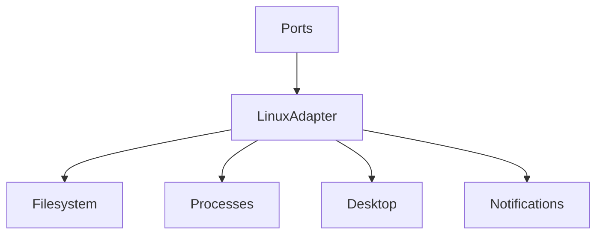
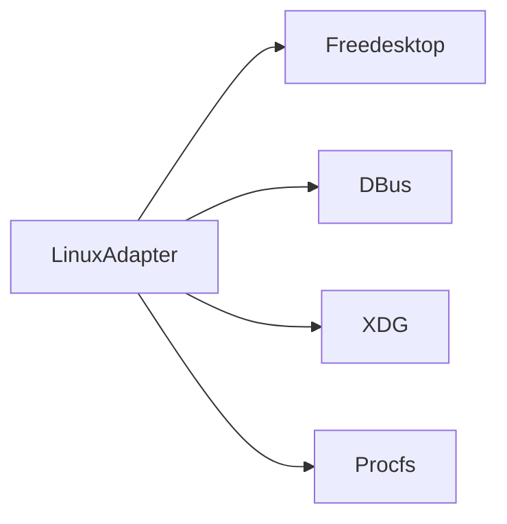
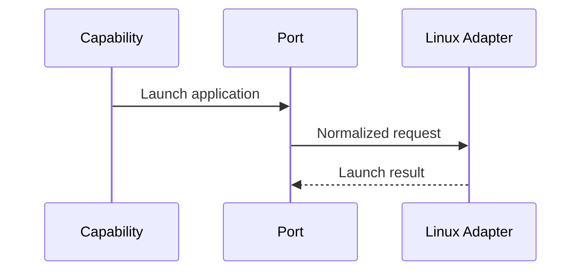

# Linux Adapter Specification

## Purpose

This document defines the first platform adapter for Atlas: Linux on Ubuntu, Debian, and Kali Linux.

## Overview

The Linux adapter implements Atlas adapter ports using Linux APIs, desktop environment interfaces, process control, filesystem APIs, and application-specific integrations.

## Motivation

Linux is the initial target because it offers strong local development ergonomics, transparent system APIs, and broad open-source tooling.

## Architecture

## Design Decisions

Support multiple desktop environments through capability detection. Avoid assuming GNOME-only behavior in core contracts.

## Component Diagram

## Sequence Diagram

## Folder Structure

`atlas/adapters/linux`.

## Public Interfaces

Implements filesystem, process, desktop, window, clipboard, notification, browser, and package discovery ports.

## Implementation Strategy

Start with filesystem, process, Git, and notification support. Add desktop/window control after evaluating accessibility and compositor differences. Detailed Linux kernel, desktop, D-Bus, package-manager, permission, Wayland/X11, and filesystem guidance is defined in [Linux System Interfaces](/code/ATLAS/docs/specifications/linux-system-interfaces.md).

## Testing

Use adapter conformance tests plus distro-specific smoke tests for Ubuntu, Debian, and Kali.

## Security

Honor Linux permissions and Atlas scopes. Never escalate privileges implicitly.

## Future Improvements

Add Wayland/X11-specific modules, systemd user service integration, and Flatpak/Snap awareness.

## References

- [Cross Platform Layer](/code/ATLAS/docs/architecture/cross-platform-layer.md)
- [Linux System Interfaces](/code/ATLAS/docs/specifications/linux-system-interfaces.md)
