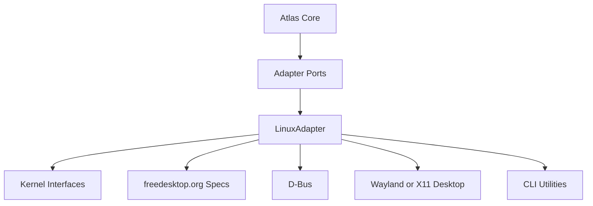
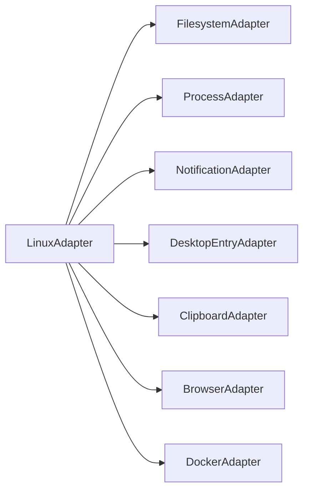
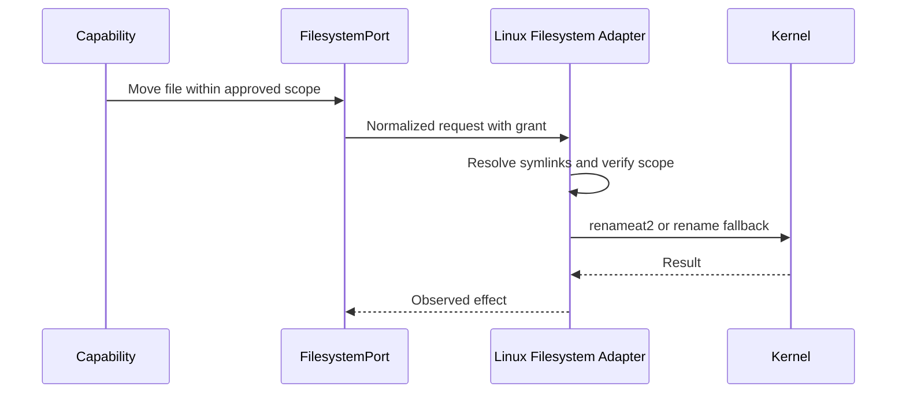
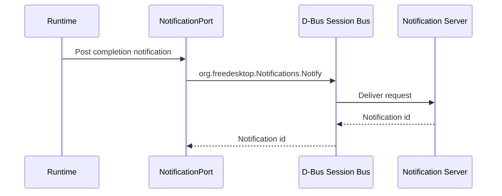
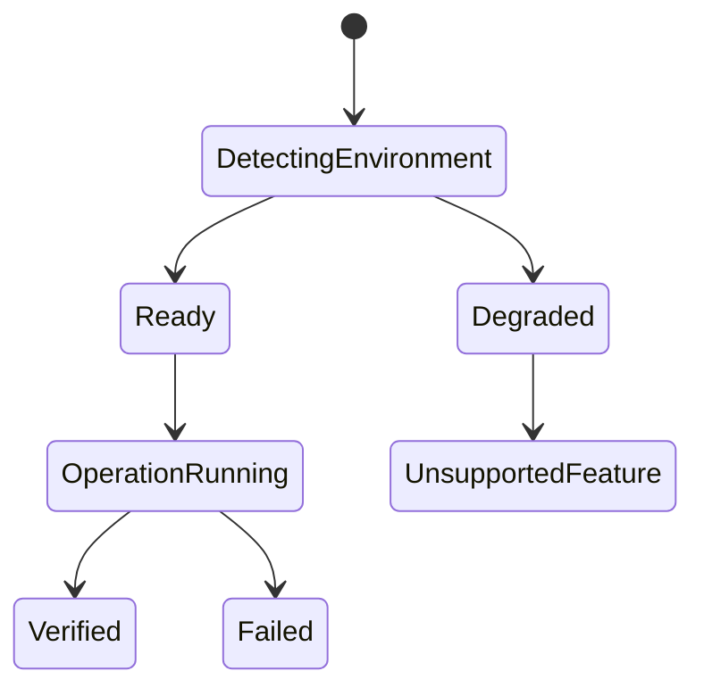

# Linux System Interfaces

## Purpose

This document defines the Linux APIs, services, and conventions Atlas may use for its first supported platform: Ubuntu, Debian, and Kali Linux.

## Problem Statement

Atlas must integrate deeply with Linux without letting Linux-specific assumptions leak into core business logic. Engineers need a precise map of kernel interfaces, syscalls, libraries, desktop APIs, D-Bus services, Wayland/X11 differences, package managers, permissions, and filesystem behavior.

## Why This Subsystem Exists

The Linux adapter turns Atlas adapter ports into concrete local-machine operations. It is the first proof that the cross-platform architecture can control real machine state safely.

## User Stories

- As a Linux user, I need Atlas to understand files, processes, notifications, terminals, browsers, and project state without requiring cloud services.
- As an adapter engineer, I need to know which Linux interfaces to wrap and which to avoid.
- As a security engineer, I need Atlas to respect Unix permissions and avoid implicit privilege escalation.
- As a future Windows/macOS engineer, I need Linux behavior documented as one adapter implementation, not as core truth.

## Functional Requirements

- Implement filesystem read, write, move, delete, watch, and metadata operations through `FilesystemPort`.
- Implement process launch, cancellation, output streaming, exit status, and environment scoping through `ProcessPort`.
- Implement application discovery through XDG desktop entries.
- Implement notifications through the freedesktop notification D-Bus interface.
- Implement clipboard and window/desktop integration behind capability detection.
- Implement browser integration through explicit browser profiles and debug protocols where authorized.
- Implement Docker inventory through the Docker Engine API or CLI wrapper only with explicit grants.

## Non-Functional Requirements

- No Linux API may be imported by the planner or core runtime.
- All mutating operations require scoped permission grants.
- Adapter behavior must be covered by conformance tests.
- The adapter must degrade gracefully across desktop environments.
- The adapter must avoid root requirements for normal operation.

## Architecture



## Component Diagram



## Sequence Diagrams





## State Diagrams



## Folder Structure

```text
atlas/adapters/linux/
  environment.py
  filesystem.py
  processes.py
  desktop_entries.py
  notifications.py
  clipboard.py
  windows.py
  browser.py
  docker.py
  packages.py
tests/conformance/linux/
```

## Internal Modules

- `LinuxEnvironmentDetector`: detects distro, desktop session, Wayland/X11, systemd user session, D-Bus availability, browser installations, Docker availability, and package managers.
- `LinuxFilesystemAdapter`: implements filesystem port operations using Python or native bindings while preserving scope checks.
- `LinuxProcessAdapter`: launches scoped commands with controlled environment, cwd, stdin, stdout, stderr, timeout, and cancellation.
- `LinuxNotificationAdapter`: posts passive notifications through the session D-Bus service.
- `LinuxDesktopEntryAdapter`: discovers launchable applications through XDG desktop entry directories.
- `LinuxPackageAdapter`: detects `apt`, `dpkg`, and optional distro package information for diagnostics.

## Public Interfaces

The Linux adapter implements the cross-platform ports:

```text
FilesystemPort
ProcessPort
ApplicationPort
NotificationPort
ClipboardPort
WindowPort
BrowserPort
DockerPort
PackagePort
```

## Data Flow

Capabilities receive scoped handles from the runtime. Adapter requests include grants and normalized resources. Linux adapter modules resolve platform details, perform operations, normalize observed state, and return structured results.

## Lifecycle

The Linux adapter initializes by detecting environment capabilities. Each operation validates the execution grant, checks platform availability, performs the operation, verifies observed state where possible, and records adapter diagnostics.

## Threading Model

Filesystem watching, process output streaming, browser protocol sessions, and Docker event streams run as cancellable background tasks. Mutating filesystem operations for a single transaction are serialized.

## IPC Model

- CLI-to-service IPC uses Unix domain sockets under `$XDG_RUNTIME_DIR/atlas`.
- Desktop notifications use the D-Bus session bus.
- Docker integration may use the Unix socket `unix:///var/run/docker.sock` only when the user belongs to the appropriate group or explicitly configures rootless Docker.
- Browser automation may use local debugging sockets or ports only for approved browser profiles.

## Storage

Linux-specific runtime files belong under XDG directories:

| Data Type | Location |
| --- | --- |
| Config | `$XDG_CONFIG_HOME/atlas` or `~/.config/atlas` |
| Durable data | `$XDG_DATA_HOME/atlas` or `~/.local/share/atlas` |
| State and logs | `$XDG_STATE_HOME/atlas` or `~/.local/state/atlas` |
| Cache | `$XDG_CACHE_HOME/atlas` or `~/.cache/atlas` |
| Sockets | `$XDG_RUNTIME_DIR/atlas` |

## Kernel Interfaces

| Interface | Atlas Use | Notes |
| --- | --- | --- |
| VFS syscalls | File read/write/move/delete metadata | Use high-level language APIs where they preserve semantics |
| `renameat2` or `rename` | Atomic moves where possible | Fall back carefully across filesystems |
| `stat`, `lstat`, `openat` | Metadata and symlink-safe traversal | Required for scope enforcement |
| `inotify` | Filesystem watching | Directory and inode semantics must be understood |
| `procfs` | Process inventory and diagnostics | Read-only by default |
| signals | Process cancellation | Prefer graceful termination before kill |
| Unix domain sockets | Local service IPC | Store under private runtime directory |

## System Calls

Atlas code should normally use standard library wrappers, but the adapter design must account for syscall semantics:

- `openat` and directory file descriptors help avoid time-of-check/time-of-use races.
- `rename` is atomic within a filesystem but cross-device moves require copy-and-verify.
- `unlink` and `rmdir` are destructive and require explicit approval.
- `fork`, `execve`, `posix_spawn`, and process groups affect command cancellation.
- `poll`/`epoll` can monitor inotify descriptors, sockets, and process streams.

## Libraries

Prefer stable wrappers when they reduce platform complexity:

- Filesystem watching: wrap a mature watcher library where available; expose normalized events.
- D-Bus: use maintained D-Bus bindings rather than shelling out to `dbus-send`.
- Git: prefer library or CLI wrapper behind `GitPort`; never parse porcelain output when a structured command exists.
- Docker: prefer Docker Engine API through SDK or constrained CLI wrapper.

## Desktop APIs

| API | Use | Constraints |
| --- | --- | --- |
| XDG Base Directory | Config, data, state, cache, runtime paths | Required for Linux hygiene |
| Desktop Entry Spec | Application discovery and launch metadata | Ignore unknown keys safely |
| Desktop Notifications | Passive status messages | Server capabilities vary |
| D-Bus Session Bus | Desktop services | Must handle service absence |
| Portals | Future screen/window/file mediation | Important for sandboxed desktops |

## CLI Utilities

CLI tools may be wrapped only when their output is stable or the command provides machine-readable output:

| Utility | Allowed Use | Caution |
| --- | --- | --- |
| `git` | Repository status, diff, commit with approved capability | Prefer porcelain v2 or structured formats |
| `docker` | Fallback Docker operations | Socket permissions are high authority |
| `xdg-open` | User-approved file or URL open | Not for hidden automation |
| `notify-send` | Development fallback only | D-Bus binding preferred |
| `systemctl --user` | Future service lifecycle | Requires clear user-service policy |
| `dpkg-query`, `apt-cache` | Package diagnostics | Read-only by default |

## D-Bus Services

The first supported D-Bus surface is `org.freedesktop.Notifications`. Atlas must call `GetCapabilities` before assuming actions, persistence, body markup, or images are supported.

## Wayland And X11 Differences

Wayland intentionally restricts global window inspection, synthetic input, and screen capture. Atlas must use desktop portals or environment-supported APIs instead of bypassing compositor security. X11 allows broader inspection and input control, but Atlas must still enforce the same permissions so behavior does not become less safe on X11.

## Permissions

Atlas runs as the user by default. It must not ask for root privileges for normal workflows. Linux capabilities such as `CAP_DAC_OVERRIDE`, `CAP_SYS_ADMIN`, and `CAP_SYS_PTRACE` are too broad for standard Atlas operation and should be treated as unsupported unless a future audited mode requires them.

## System Services

The future local service should run as a user service, not a system service. A systemd user unit may manage the long-running event bus, scheduler, and approval broker after lifecycle tests exist.

## Package Manager Integration

Ubuntu, Debian, and Kali use `apt`/`dpkg` families. Atlas may inspect package presence for diagnostics but must not install packages without explicit user approval and a package-management capability.

## Filesystem APIs

Scope enforcement must canonicalize paths, account for symlinks, avoid following symlinks when unsafe, detect cross-device moves, and preserve metadata only when policy allows it.

## Error Handling

Linux adapter errors map to the shared taxonomy: unsupported environment, permission denied, path outside scope, dependency missing, service unavailable, process timeout, partial effect, and verification failed.

## Recovery Strategy

Filesystem recovery uses transaction logs with original path, destination path, hash where available, mtime, size, and operation id. Process recovery uses cancellation and clear residual-state reporting because command side effects may be irreversible.

## Security

The adapter must validate grants again even though runtime already did. It must refuse path traversal, symlink escape, unapproved shell expansion, unauthorized browser profiles, Docker daemon access without explicit grant, and clipboard reads outside approved context.

## Performance Considerations

Use incremental watchers instead of full rescans. Batch file metadata reads. Avoid blocking the runtime on long-running process output. Apply resource budgets to OCR, document parsing, and repository indexing.

## Definition Of Done

The Linux adapter is done when conformance tests pass on Ubuntu, Debian, and Kali for filesystem, process, notification, desktop entry, Git, Docker inventory, and degraded desktop behavior.

## Future Improvements

Add portal support, rootless Docker detection, Wayland compositor-specific capabilities, and package installation workflows.

## References

- XDG Base Directory Specification: https://specifications.freedesktop.org/basedir/0.8/
- Desktop Notifications Specification: https://specifications.freedesktop.org/notification/latest-single/
- Desktop Entry Specification: https://xdg.pages.freedesktop.org/xdg-specs/desktop-entry/latest-single/
- D-Bus Specification: https://dbus.freedesktop.org/doc/dbus-specification.html
- inotify manual: https://man7.org/linux/man-pages/man7/inotify.7.html
- procfs manual: https://www.man7.org/linux/man-pages/man5/procfs.5.html
- Linux capabilities manual: https://man7.org/linux/man-pages/man7/capabilities.7.html

## Related Documents

- [Linux Adapter](/code/ATLAS/docs/specifications/linux-adapter.md)
- [Cross Platform Layer](/code/ATLAS/docs/architecture/cross-platform-layer.md)
- [Runtime Integrations](/code/ATLAS/docs/specifications/runtime-integrations.md)
