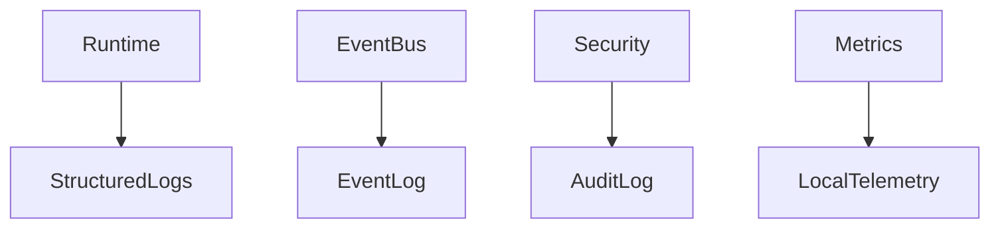
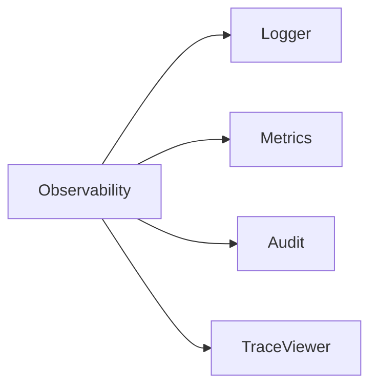
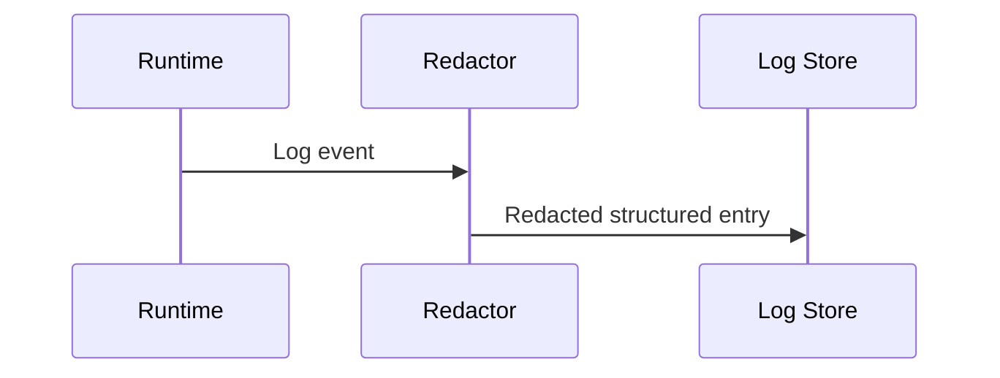

# Logging and Telemetry Specification

## Purpose

This document defines observability for Atlas while preserving privacy and offline operation.

## Overview

Atlas logs decisions, events, runtime steps, permission checks, adapter calls, failures, and performance metrics locally. Telemetry is local by default and external reporting is opt-in.

## Motivation

Users and contributors need to understand what Atlas did, why it did it, and how to reproduce failures.

## Architecture



## Design Decisions

Use structured logs with redaction before persistence. Audit logs are append-only for security-relevant actions.

## Component Diagram



## Sequence Diagram



## Folder Structure

```text
atlas/observability/
  logging.py
  metrics.py
  audit.py
  redaction.py
```

## Public Interfaces

`Logger.info(event_type, fields)`, `AuditLog.record(audit_event)`, and `Metrics.observe(metric, value, labels)`.

## Implementation Strategy

Ship local structured logging and audit logs before live integrations. Add a local trace viewer later.

## Testing

Test redaction, audit immutability, log schema stability, and metric collection under failures.

## Security

Never log raw secrets, clipboard text, screen captures, full prompts, or file contents unless explicitly configured for debugging.

## Future Improvements

Add OpenTelemetry export as an opt-in developer mode and privacy-preserving diagnostics bundles.

## References

- [Security](/code/ATLAS/docs/architecture/security.md)
