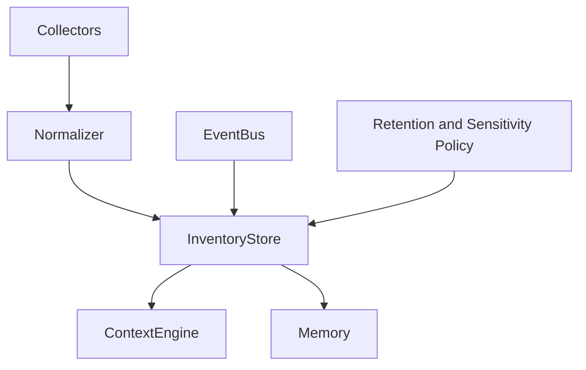
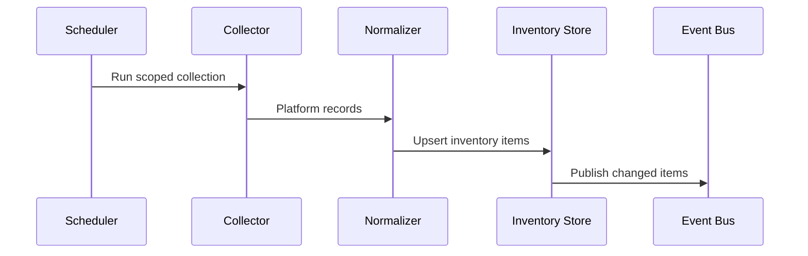
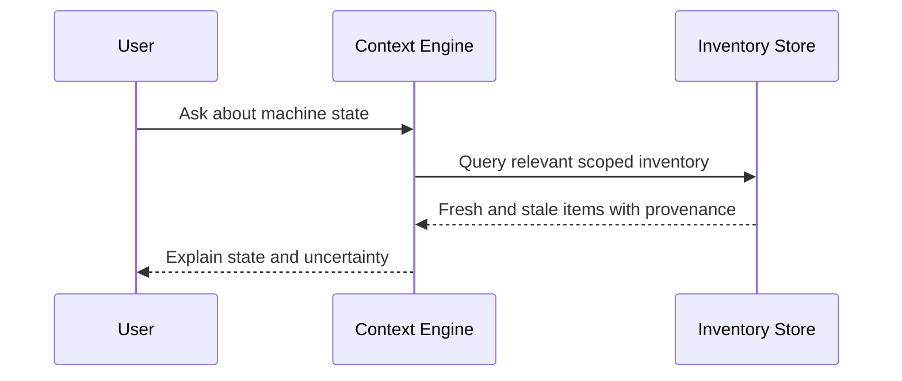
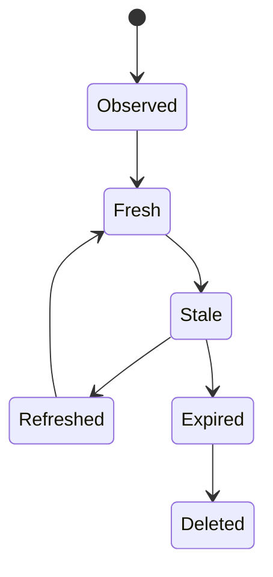

# Machine State and Inventory

## Purpose

This document defines the machine-state model Atlas maintains continuously across files, projects, applications, services, hardware, system health, package managers, calendars, notes, audio, video, and workflows.

## Motivation

Atlas should not rediscover the computer from scratch for every request. It needs an always-improving local model of the machine that is fresh enough to act on, scoped enough to protect privacy, and structured enough for deterministic capabilities.

## Problem Statement

Local computers expose state through many inconsistent surfaces: filesystems, Git repositories, process tables, package databases, desktop sessions, D-Bus services, browser profiles, Docker daemons, device files, sysfs, procfs, calendars, and note stores. Without a normalized inventory model, planners would receive noisy context and adapters would duplicate discovery logic.

## Requirements

- Maintain local inventory for supported machine surfaces without cloud services.
- Distinguish observed state, inferred state, cached state, and user-declared preferences.
- Track freshness, provenance, sensitivity, and confidence for every inventory item.
- Allow users to delete, export, and inspect stored inventory.
- Keep platform-specific collection inside adapters and collectors.

## Goals

- Give the context engine fast, scoped access to current machine state.
- Allow workflows to react to changes through the event bus.
- Support system health and project-awareness features without broad rescans.

## Non Goals

- Atlas does not replace system monitoring tools.
- Atlas does not collect all possible telemetry by default.
- Atlas does not upload inventory to cloud providers.
- Atlas does not require privileged hardware or kernel access for normal operation.

## Architecture Overview



## Component Responsibilities

| Component | Responsibility |
| --- | --- |
| Inventory collectors | Read state from adapters and integrations |
| Normalizer | Convert platform-specific records to Atlas inventory types |
| Inventory store | Persist current and recent observed state |
| Freshness manager | Decide when cached state is stale |
| Sensitivity classifier | Mark secrets, personal data, and high-risk resources |
| Context bridge | Select scoped inventory for planner input |

## Interfaces

```text
InventoryCollector.collect(scope) -> InventoryBatch
InventoryStore.upsert(item)
InventoryStore.query(selector) -> InventoryResult
FreshnessPolicy.is_stale(item, now) -> bool
SensitivityClassifier.classify(item) -> Sensitivity
```

## Contracts

Every inventory item includes:

```text
id
kind
resource_uri
platform
observed_at
fresh_until
provenance
sensitivity
confidence
attributes
```

## Folder Structure

```text
atlas/core/inventory/
  schema.py
  store.py
  freshness.py
  sensitivity.py
  selectors.py
atlas/integrations/
  system_health/
  hardware/
  package_managers/
  calendars/
  notes/
  audio_video/
tests/integration/inventory/
```

## Lifecycle

Inventory starts as observed state, becomes normalized state, is stored with freshness metadata, may be promoted into memory when durable relevance is clear, and is deleted according to retention policy or user request.

## Execution Flow



## Sequence Diagrams



## State Diagrams



## Failure Handling

Collectors must fail independently. A Docker collector failure must not block filesystem or Git inventory. Failed collection records a degraded-state event and keeps prior inventory marked stale.

## Recovery

On restart, Atlas loads last-known inventory, marks items stale according to freshness policy, and schedules targeted refresh jobs.

## Performance

Inventory collection is incremental. Expensive scans use budgets and produce partial results. Hardware and system-health collectors avoid high-frequency polling unless a user-enabled diagnostic workflow requires it.

## Security

Sensitive state such as browser sessions, clipboard contents, calendar details, notes, microphone devices, camera devices, and package repositories requires explicit scope before planner exposure.

## Logging

Log collection start/end, item counts, skipped scopes, staleness, and collector errors. Do not log raw file contents, clipboard contents, note text, calendar descriptions, or browser page content by default.

## Metrics

Track collector duration, item count, stale item count, storage size, query latency, and failure rate per collector.

## Configuration

Users can configure collection scopes, ignored paths, project roots, package manager inspection, browser profiles, Docker access, calendar sources, note locations, and hardware/system-health polling intervals.

## Future Extensions

Add video capture metadata, display topology history, system-health anomaly detection, package update planning, and workflow learning from repeated inventory transitions.

## Testing

Test collectors with fixtures, fake adapters, large file trees, unavailable services, stale data, sensitivity redaction, deletion, export, and event replay.

## Acceptance Criteria

- Context snapshots can use inventory without direct platform calls.
- Stale inventory is clearly labeled.
- Sensitive inventory is not exposed to planners without permission.
- Collector failures do not collapse unrelated inventory surfaces.

## Related Documents

- [Context Engine](/code/ATLAS/docs/architecture/context-engine.md)
- [Memory](/code/ATLAS/docs/architecture/memory.md)
- [Linux System Interfaces](/code/ATLAS/docs/specifications/linux-system-interfaces.md)

## References

- [Implementation Map](/code/ATLAS/docs/implementation/implementation-map.md)
- [Storage](/code/ATLAS/docs/specifications/storage.md)
