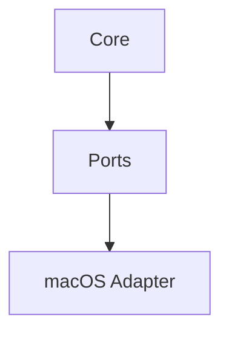
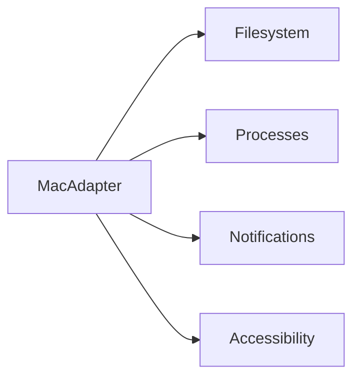
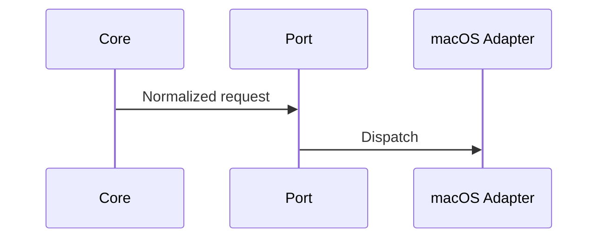

# macOS Adapter Specification

## Purpose

This document reserves the macOS adapter contract while keeping Atlas core platform independent.

## Overview

The macOS adapter will implement Atlas ports using macOS filesystem, process, notification, accessibility, automation, and permission APIs.

## Motivation

macOS has strong desktop automation needs but strict privacy controls. Atlas must respect those controls by design.

## Architecture

## Design Decisions

Core logic may not assume Linux paths, shell behavior, or desktop APIs. macOS permissions such as accessibility and screen recording must be explicit in user flows.

## Component Diagram

## Sequence Diagram

## Folder Structure

`atlas/adapters/macos`.

## Public Interfaces

Same adapter ports as Linux.

## Implementation Strategy

Design Linux code against adapter conformance tests so macOS can implement equivalent behavior later.

## Testing

Add macOS conformance and permission-flow tests when implementation begins.

## Security

Respect macOS privacy prompts and avoid hidden automation paths.

## Future Improvements

Implement after Linux contracts and user workflows are stable.

## References

- [Cross Platform Layer](/code/ATLAS/docs/architecture/cross-platform-layer.md)
