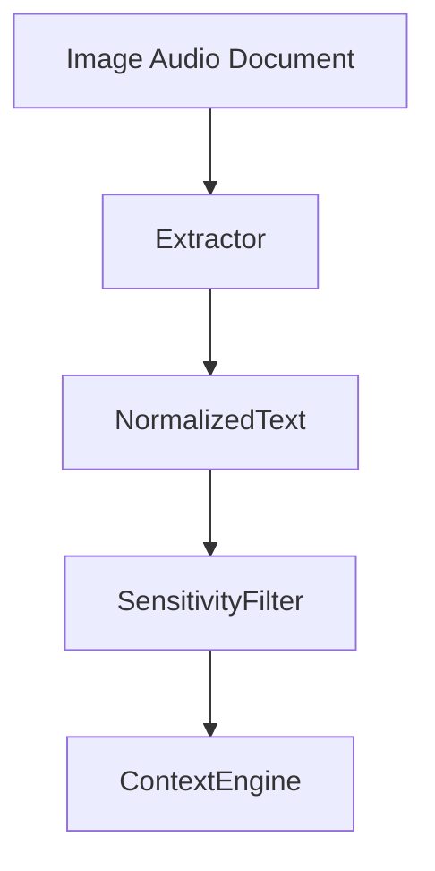
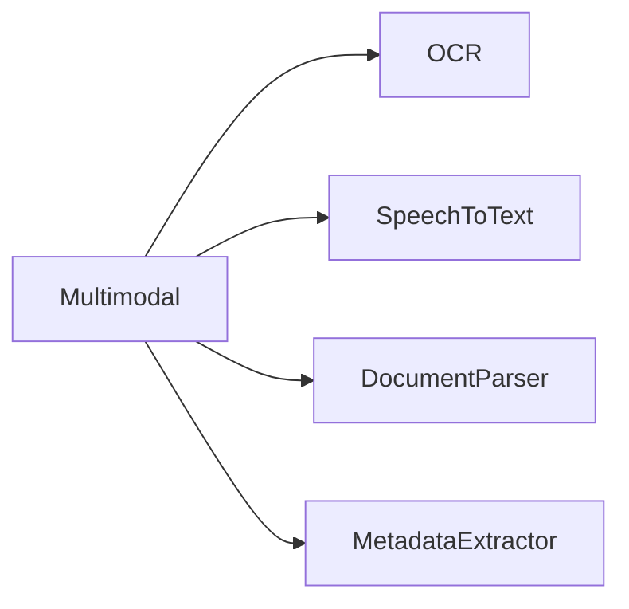
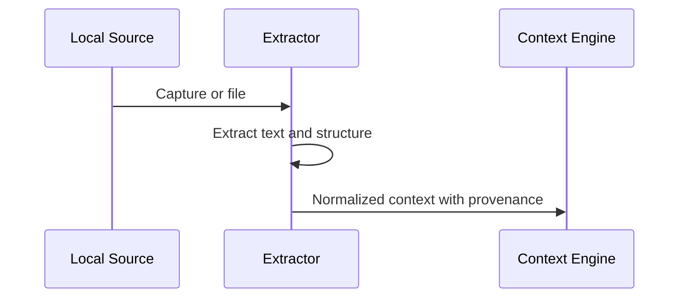

# OCR, Speech, and Document Processing

## Purpose

This document defines multimodal processing for OCR, speech, and documents.

## Overview

Atlas should understand screenshots, scanned documents, audio commands, meeting notes, PDFs, and local documents while preserving user privacy.

## Motivation

Computers contain more than plain text. A useful operating layer must extract meaning from visual, audio, and document sources without forcing cloud upload.

## Architecture



## Design Decisions

OCR and speech are treated as context collectors, not privileged action channels. Voice commands still pass through planner, runtime, and permission checks.

## Component Diagram



## Sequence Diagram



## Folder Structure

```text
atlas/integrations/
  ocr/
  voice/
  documents/
```

## Public Interfaces

`OCRPort.extract(image)`, `SpeechPort.transcribe(audio)`, and `DocumentPort.parse(file)`.

## Implementation Strategy

Evaluate mature local-first libraries before implementing. Prefer wrapping engines with stable licenses and active maintenance.

## Testing

Test noisy images, multilingual text, offline speech, malformed PDFs, large documents, and sensitive-data redaction.

## Security

Screen capture, microphone access, and document parsing require explicit scopes and visible indicators.

## Future Improvements

Add layout-aware document memory, voice wake-word policy, and multimodal workflow triggers.

## References

- [Dependency Evaluations](/code/ATLAS/docs/research/dependency-evaluations.md)
