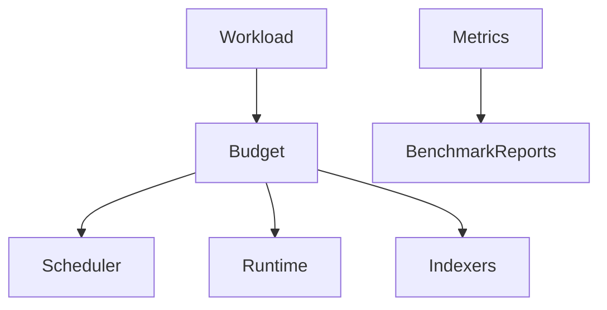
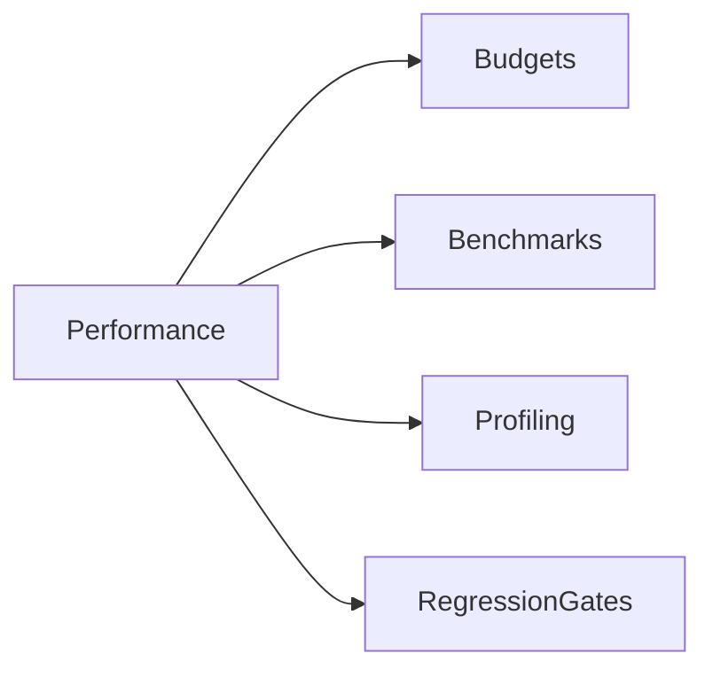
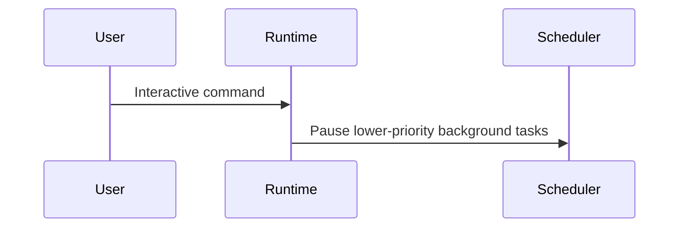

# Performance Specification

## Purpose

This document defines performance expectations for Atlas.

## Overview

Atlas must feel responsive while indexing and coordinating a local machine. Background work should not degrade interactive use.

## Motivation

An operating layer that consumes excessive CPU, memory, battery, disk, or startup time will not earn user trust.

## Architecture

## Design Decisions

Interactive commands receive priority over background indexing. Expensive scans are incremental and cancellable.

## Component Diagram

## Sequence Diagram

## Folder Structure

Benchmarks live in [docs/benchmarks](/code/ATLAS/docs/benchmarks) and future `tests/performance`.

## Public Interfaces

Performance budgets should cover startup time, command planning latency, capability execution overhead, memory index update time, idle CPU, and storage growth.

## Implementation Strategy

Measure before optimizing. Add benchmark fixtures early so regressions are visible.

## Testing

Performance tests should include cold start, warm start, large repository indexing, many-file downloads folder organization, and event replay.

## Security

Performance diagnostics must follow the same redaction rules as logs.

## Future Improvements

Add adaptive scheduling, battery-aware indexing, and user-configurable resource budgets.

## References

- [Benchmark Plan](/code/ATLAS/docs/benchmarks/performance-plan.md)
