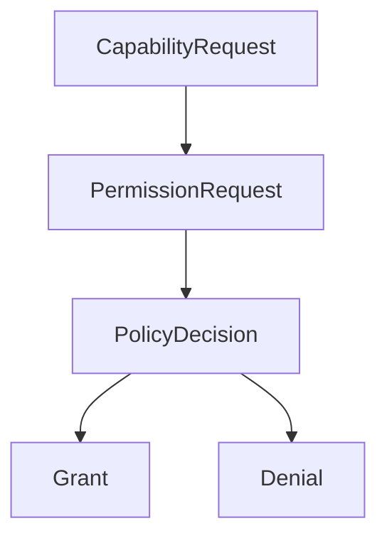
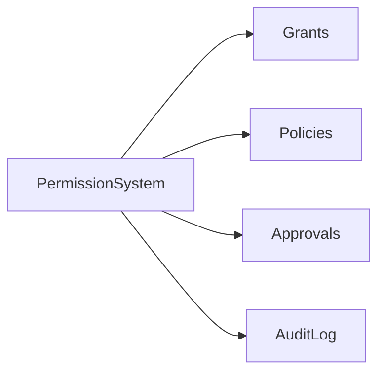
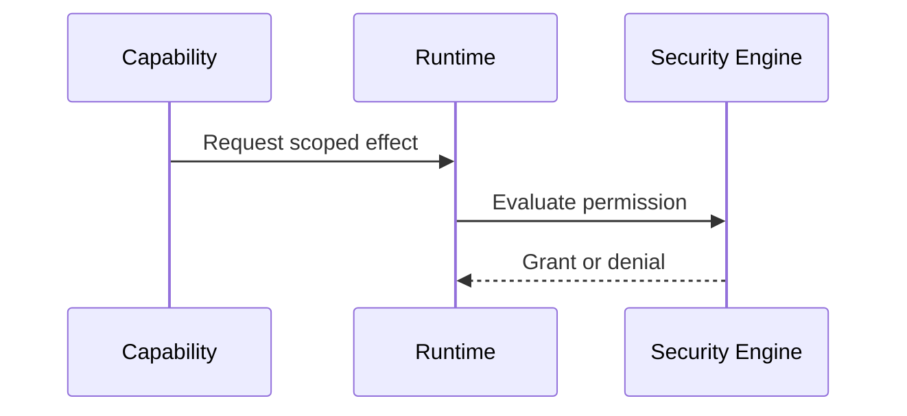

# Permissions Specification

## Purpose

This document defines how Atlas represents and enforces authority.

## Overview

Permissions are scoped grants attached to capability execution. A grant names actor, action, resource, duration, risk level, approval state, and audit requirements.

## Motivation

Atlas cannot safely operate as an all-powerful local assistant. It needs precise permission boundaries that users can understand.

## Architecture



## Design Decisions

Use deny-by-default policy. Destructive file operations, shell execution, browser form submission, clipboard reads, screen capture, credential access, network access, and plugin installation require explicit permission.

## Component Diagram



## Sequence Diagram



## Folder Structure

Policy definitions live in `atlas/core/security/policies`; schemas live in `atlas/core/security/permissions.py`.

## Public Interfaces

```text
PermissionRequest(actor, capability, action, resource, duration, risk, reason)
PermissionGrant(id, scope, expires_at, approved_by, audit_level)
PolicyDecision(allowed, approval_required, reason, grant)
```

## Implementation Strategy

Implement path, process, browser-profile, plugin, and network scopes first. Add policy import/export once local enforcement is stable.

## Testing

Test allowed, denied, expired, narrowed, and revoked grants. Include path traversal, symlink, shell injection, and plugin escalation cases.

## Security

Permissions are enforced in runtime and validated again at adapter boundaries.

## Future Improvements

Add signed policy packs, enterprise-managed policies, and time-limited delegated approvals.

## References

- [Security Architecture](/code/ATLAS/docs/architecture/security.md)
