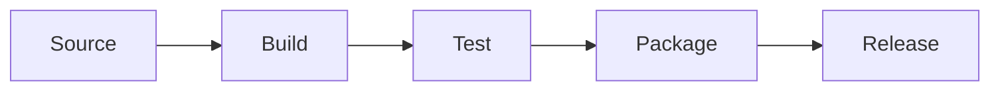
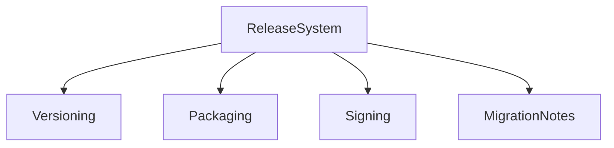
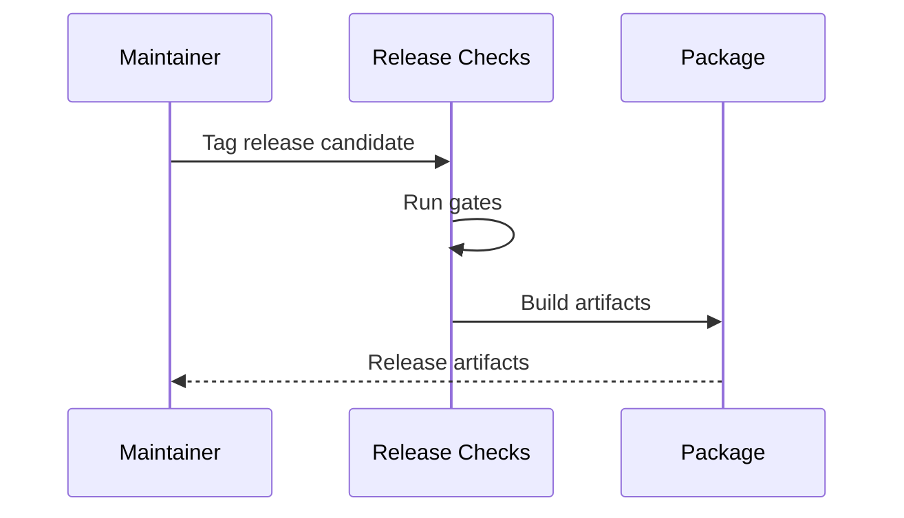

# Release, Packaging, and Deployment

## Purpose

This document defines release strategy, packaging, and deployment for Atlas.

## Overview

Atlas releases should be reproducible, locally installable, signed where practical, and clear about supported platforms.

## Motivation

Users are trusting Atlas with their computers. Releases must be understandable, reversible, and secure.

## Architecture

## Design Decisions

The initial deployment target is local Linux. Packaging should avoid background services until permissions, logs, and lifecycle management are stable.

## Component Diagram

## Sequence Diagram

## Folder Structure

Packaging scripts should eventually live in `packaging/`; release notes in `docs/releases`.

## Public Interfaces

Release artifacts should include CLI, local service configuration when available, documentation, checksums, and migration notes.

## Implementation Strategy

Start with source installs and developer CLI. Add Debian packages, AppImage, or Flatpak only after runtime lifecycle is stable.

## Testing

Release gates include unit, integration, security, performance smoke, migration, install, uninstall, and rollback tests.

## Security

Publish checksums and sign releases before encouraging non-developer installation.

## Future Improvements

Add distro packages, auto-update policy, and plugin compatibility checks.

## References

- [Roadmap](/code/ATLAS/ROADMAP.md)
