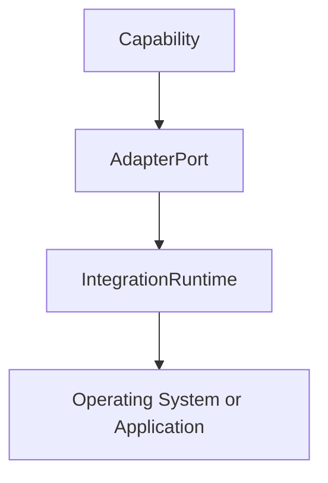
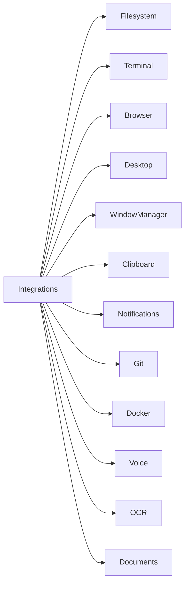
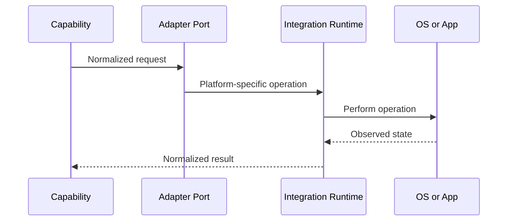

# Runtime Integrations Specification

## Purpose

This specification defines the machine-facing runtimes and integrations Atlas must support: filesystem, terminal, browser, desktop, window manager, clipboard, notifications, Git, Docker, applications, networking, voice, OCR, and documents.

## Overview

Integrations expose platform capabilities through adapter ports and high-level capabilities. They must never be presented to the planner as raw tools.

## Motivation

Atlas's value comes from understanding and coordinating the user's computer. Integration quality determines whether Atlas feels like a dependable operating layer or a brittle automation script.

## Architecture



## Design Decisions

Each integration has read operations, mutation operations, permissions, event sources, failure modes, and verification rules. Mutation operations require stronger policy checks than observation.

## Component Diagram



## Sequence Diagram



## Folder Structure

```text
atlas/integrations/
  filesystem/
  terminal/
  browser/
  desktop/
  windows/
  clipboard/
  notifications/
  git/
  docker/
  applications/
  networking/
  voice/
  ocr/
  documents/
```

## Public Interfaces

Filesystem operations include scoped listing, reading, writing, moving, deleting with approval, hashing, and watching. Terminal operations include command planning, execution, streaming output, cancellation, exit status, and working-directory scope. Browser operations include profile detection, tab inventory, navigation, extraction, and safe form interaction. Desktop operations include application discovery, launch, focus, window enumeration, and notification posting.

## Implementation Strategy

Implement read-only inventory first. Add mutation through capabilities with verification and rollback. Use stable open-source libraries where possible and wrap platform APIs directly only when library maintenance or licensing is unsuitable.

## Testing

Each integration needs unit tests for normalization, adapter conformance tests, live integration tests behind opt-in markers, failure tests, recovery tests, and permission tests. Shared error taxonomy and recovery rules are defined in [Error Handling and Recovery](/code/ATLAS/docs/specifications/error-recovery.md).

## Security

Integrations are high-risk boundaries. They must enforce path scopes, process scopes, browser profile scopes, clipboard sensitivity, and command restrictions.

## Future Improvements

Add richer application-specific integrations, accessibility-tree navigation, document semantic indexing, and multimodal desktop understanding.

## References

- [Filesystem and Terminal Examples](/code/ATLAS/docs/examples/capability-manifests.md)
- [Dependency Evaluations](/code/ATLAS/docs/research/dependency-evaluations.md)
- [Error Handling and Recovery](/code/ATLAS/docs/specifications/error-recovery.md)
