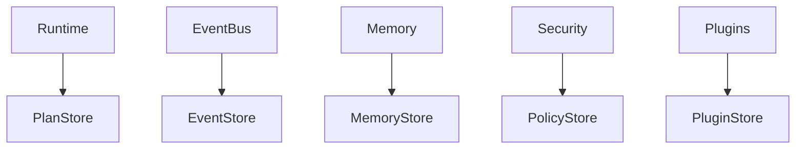
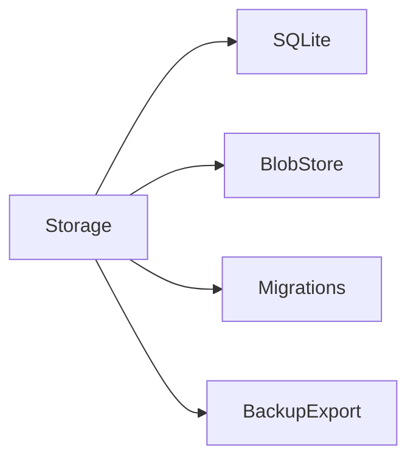
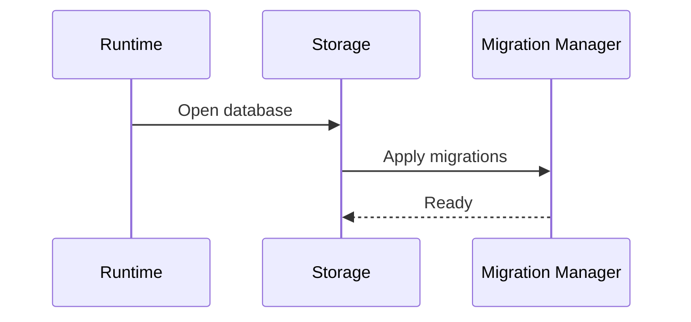

# Storage Specification

## Purpose

This document defines Atlas local storage for memory, events, plans, policies, logs, plugin metadata, and workflow traces.

## Overview

Atlas storage must be local, durable, inspectable, migratable, and optionally encrypted.

## Motivation

Atlas learns from the machine over time. Storage failures or opaque schemas would make the system unreliable and hard to debug.

## Architecture



## Design Decisions

SQLite is the preferred first structured store because it is local, portable, embeddable, and well understood. Filesystem-backed blobs may hold large artifacts. Vector indexes are optional.

## Component Diagram



## Sequence Diagram



## Folder Structure

```text
atlas/storage/
  sqlite/
  migrations/
  blobs/
  export.py
```

## Public Interfaces

`Storage.open(profile: Profile)`, `Storage.transaction()`, `Storage.migrate()`, and `Storage.export(scope)`.

## Implementation Strategy

Start with one local profile database. Add migrations from the first schema. Never use ad hoc unversioned storage for durable state.

## Testing

Test migrations, corruption handling, backups, concurrent readers, transaction rollback, and deletion requests.

## Security

Sensitive values require redaction, encryption planning, and strict access paths. Logs must not become a second ungoverned database.

## Future Improvements

Add encrypted-at-rest profiles, backup restore, and selective sync after local storage matures.

## References

- [Memory](/code/ATLAS/docs/architecture/memory.md)
- [Logging and Telemetry](/code/ATLAS/docs/specifications/logging-telemetry.md)
