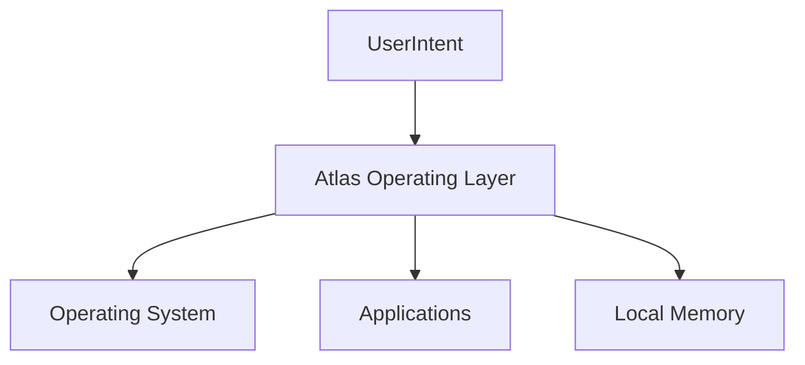
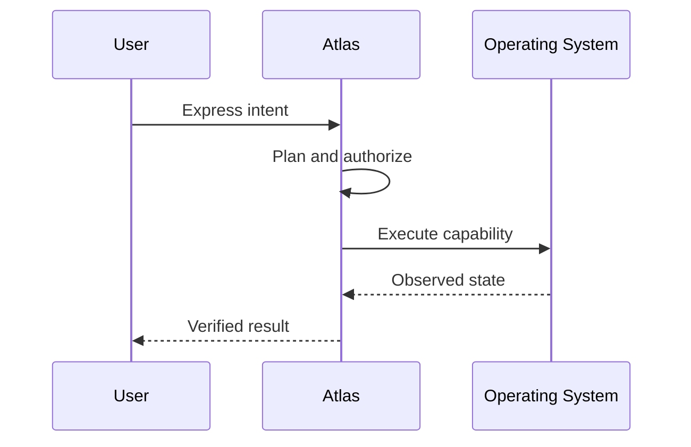

# Vision and Product Philosophy

## Purpose

This document defines the product identity of Atlas and the engineering principles that follow from it.

## Overview

Atlas is an AI operating layer: a local, privacy-preserving runtime that understands the user's computer and coordinates applications through safe capabilities.

## Motivation

Users should not need separate AI applications for every local task. Atlas should provide one durable layer that understands projects, files, windows, terminals, browsers, Git state, and user routines.

## Architecture

## Design Decisions

Atlas is local first, offline first, privacy first, capability based, event driven, deterministic at runtime, explainable in planning, approval-gated for destructive work, plugin extensible, and cross-platform in core design.

## Component Diagram

See [Architecture](/code/ATLAS/ARCHITECTURE.md).

## Sequence Diagram

## Folder Structure

Product philosophy is documented under `docs/specifications`; implementation belongs under `atlas/core` and `atlas/adapters`.

## Public Interfaces

The product interface is user intent, explainable plans, permission prompts, verified outcomes, and user-editable memory.

## Implementation Strategy

Every feature proposal must identify the user workflow it improves and the capability boundary it uses.

## Testing

Acceptance tests should verify user-visible workflows, not isolated technical tricks.

## Security

The product promise fails if Atlas surprises users with hidden data access or irreversible actions.

## Future Improvements

Refine UX patterns for approval prompts, memory review, workflow suggestions, and local model configuration.

## References

- [README](/code/ATLAS/README.md)
- [Security](/code/ATLAS/SECURITY.md)
