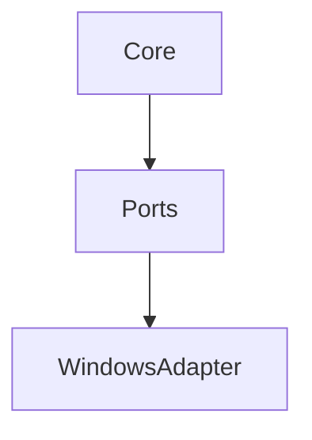
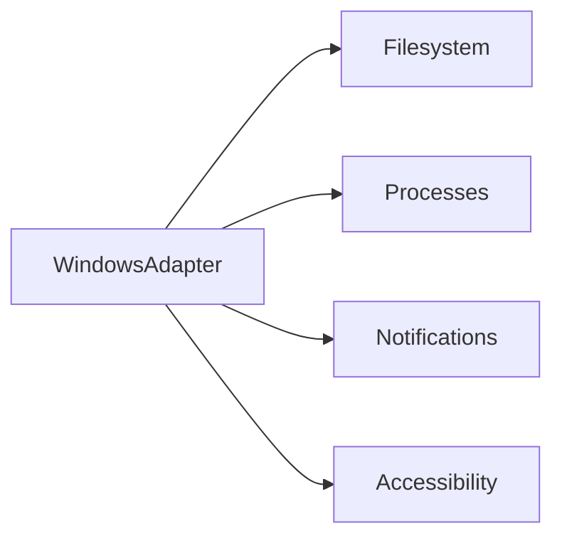
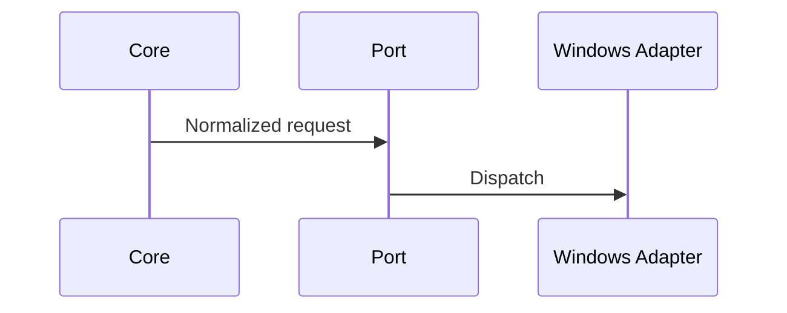

# Windows Adapter Specification

## Purpose

This document reserves the Windows adapter contract while keeping core Atlas platform independent.

## Overview

The Windows adapter will implement the same ports as Linux using Windows APIs, PowerShell, COM where appropriate, filesystem APIs, notifications, and accessibility interfaces.

## Motivation

Atlas should eventually work where users already live. Windows support must not require redesigning core architecture.

## Architecture

## Design Decisions

No current core code may assume POSIX paths, Linux process semantics, or desktop environment behavior.

## Component Diagram

## Sequence Diagram

## Folder Structure

`atlas/adapters/windows`.

## Public Interfaces

Same adapter ports as Linux.

## Implementation Strategy

Keep Windows as a conformance target during Linux development through path and process abstraction tests.

## Testing

Add CI or manual conformance tests when Windows implementation begins.

## Security

Map Atlas permissions onto Windows ACLs, process boundaries, and credential stores without silent elevation.

## Future Improvements

Implement after Linux contracts stabilize.

## References

- [Cross Platform Layer](/code/ATLAS/docs/architecture/cross-platform-layer.md)
