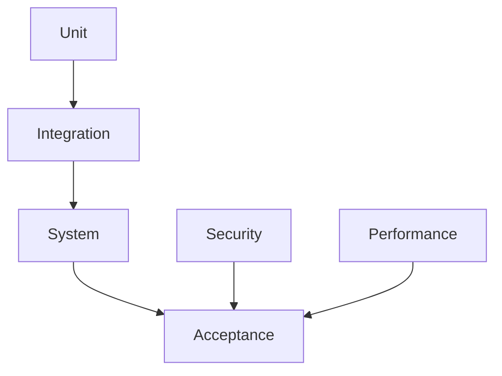
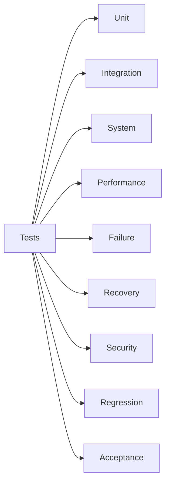
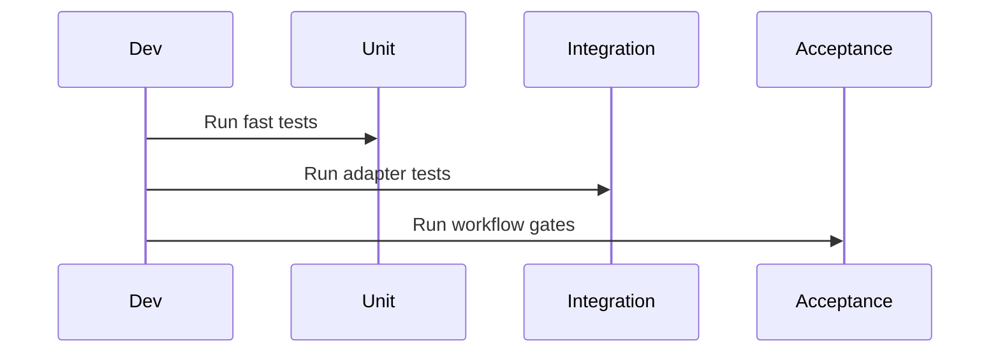

# Atlas Testing Strategy

## Purpose

This document defines the testing philosophy and required test classes for Atlas.

## Overview

Atlas requires unit, integration, system, performance, failure, recovery, security, regression, and acceptance tests. Tests must prove that user-visible workflows complete safely and explainably.

## Motivation

An AI operating layer can fail through incorrect reasoning, unsafe authority, platform differences, race conditions, stale context, and partial side effects. The test strategy must cover all of those.

## Architecture



## Design Decisions

Tests use fake adapters for deterministic core behavior and opt-in live adapters for platform conformance.

## Component Diagram



## Sequence Diagram



## Folder Structure

```text
tests/
  unit/
  integration/
  system/
  performance/
  failure/
  recovery/
  security/
  regression/
  acceptance/
  fixtures/
```

## Public Interfaces

Test harnesses should expose fake adapters, fixture profiles, plan replay tools, and capability contract validators.

## Implementation Strategy

Add contract tests before concrete adapters. Every phase owns an acceptance matrix.

## Testing

The required classes are:

- Unit tests for pure logic and schemas
- Integration tests for subsystem boundaries
- System tests for end-to-end workflows
- Performance tests for latency and resource budgets
- Failure tests for injected faults
- Recovery tests for rollback and replay
- Security tests for permission enforcement
- Regression tests for fixed defects
- Acceptance tests for phase definitions of done

## Security

Security tests are release-blocking.

## Future Improvements

Add chaos fixtures, platform labs, and generated coverage reports mapped to capability manifests.

## References

- [Roadmap](/code/ATLAS/ROADMAP.md)
